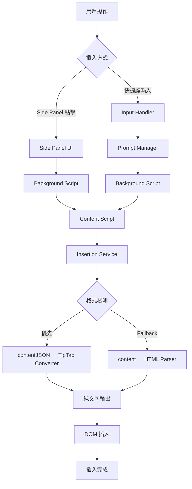
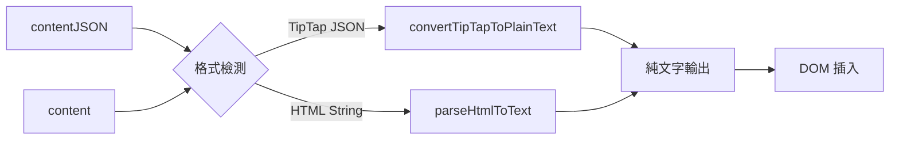

# Prompt 插入流程完整指南

## 📋 總覽

本文檔詳細說明了 Prompt 插入系統的完整流程，包含兩種主要的插入方式：Side Panel 點擊插入和快捷鍵自動插入。系統支援兩種資料格式：`contentJSON` (TipTap JSON 格式，優先) 和 `content` (HTML 格式，向後相容)。

## 🎯 資料流程圖



## 🔄 插入流程詳解

### 流程 A: Side Panel 點擊插入

#### 1️⃣ 用戶互動階段
- **觸發**: 用戶在 Side Panel 中點擊 prompt 項目
- **檔案**: `pages/content-ui/src/utils/sidePanel.ts`

```javascript
// sidePanel.ts
chrome.runtime.sendMessage({
  action: 'sidePanelInsertPrompt',
  prompt: {
    content: prompt.content,        // HTML 格式
    contentJSON: prompt.contentJSON, // TipTap JSON 格式
  }
});
```

#### 2️⃣ 背景服務處理
- **檔案**: `chrome-extension/src/background/index.ts:658`
- **函式**: `handleSidePanelInsert()`

```javascript
// background/index.ts
chrome.tabs.sendMessage(targetTabId, {
  action: 'insertPrompt',
  prompt: message.prompt.content,
  promptJSON: message.prompt.contentJSON,
});
```

#### 3️⃣ Content Script 接收
- **檔案**: `pages/content/src/messageHandler.ts:4`
- **處理**: 接收 `insertPrompt` 訊息

```javascript
// messageHandler.ts:39-45
const insertResult = await insertContent({
  content: message.prompt,           // HTML 格式
  contentJSON: message.promptJSON,   // TipTap JSON 格式 (優先)
  targetElement: activeElement,
  position: undefined,               // Side Panel 不指定位置，使用當前游標
  saveCursorPosition: true,
});
```

#### 4️⃣ 插入服務執行
- **檔案**: `pages/content/src/services/insertionService.ts:52`
- **核心轉換**: `getContentForInsertion(contentJSON, content)`

---

### 流程 B: 快捷鍵自動插入

#### 1️⃣ 輸入監聽階段
- **觸發**: 用戶在可編輯元素中輸入
- **檔案**: `pages/content/src/input/inputHandler.ts:47`
- **函式**: `handleInput()`

```javascript
// inputHandler.ts:31-36
const debouncedShortcutCheck = debounce(async (element, cursorInfo) => {
  const prompt = await findShortcutNearCursor(cursorInfo);
  if (prompt) {
    await processPromptInsertion(prompt, element, cursorInfo);
  }
}, 750);
```

#### 2️⃣ 快捷鍵查找階段
- **檔案**: `pages/content/src/input/inputHandler.ts:126`
- **流程**: 本地查找 → 背景服務查詢

```javascript
// inputHandler.ts:126-158
const prompt = getPromptByShortcut(candidate);  // 本地快取查找
if (!prompt) {
  // 向背景服務查詢
  const response = await chrome.runtime.sendMessage({
    action: 'getPromptByShortcut',
    shortcut: candidate,
  });
}
```

#### 3️⃣ Prompt 處理和插入
- **檔案**: `pages/content/src/input/inputHandler.ts:193`
- **特點**: 會替換快捷鍵文字

```javascript
// inputHandler.ts:193-199
const result = await insertContentService({
  content: prompt.content,
  contentJSON: prompt.contentJSON,   // 優先使用 JSON 格式
  targetElement: element,
  position: {                       // 替換快捷鍵文字的位置
    start: shortcutStart,
    end: cursorInfo.start,
  },
  saveCursorPosition: true,
});
```

---

### 流程 C: 表單處理 (特殊情況)

當 prompt 包含表單欄位時，會開啟特殊的表單處理流程：

#### 1️⃣ 表單視窗開啟
- **觸發**: 檢測到 prompt 包含表單欄位
- **檔案**: `chrome-extension/src/background/index.ts:590`

```javascript
// background/index.ts:590-594
popupData = {
  title: message.title,
  content: message.content,
  contentJSON: message.contentJSON,
};
```

#### 2️⃣ 表單內容解析
- **檔案**: `pages/side-panel/src/formRoot.tsx:128`
- **函式**: `parseContent(popupData.contentJSON, popupData.content)`

```javascript
// formRoot.tsx:128
const root = parseContent(popupData.contentJSON, popupData.content);
```

#### 3️⃣ 表單提交處理
- **檔案**: `pages/side-panel/src/formRoot.tsx:199`
- **流程**: 收集表單資料 → 生成最終內容 → 提交

```javascript
// formRoot.tsx:199-203
const finalOutput = generateFinalText(parsedHtmlTree, formData);
chrome.runtime.sendMessage({ action: 'submitForm', finalOutput }, () => {
  window.close();
});
```

#### 4️⃣ 表單結果插入
- **檔案**: `chrome-extension/src/background/index.ts:638`
- **特點**: 表單結果以 HTML 格式插入，不使用 JSON

```javascript
// background/index.ts:638-643
chrome.tabs.sendMessage(targetTabId, {
  action: 'insertPrompt',
  prompt: message.finalOutput,      // 表單處理後的 HTML
  promptJSON: null,                 // 表單結果不使用 JSON
});
```

## 🔧 關鍵轉換函式對照表

| 使用場景 | 調用函式 | 檔案位置 | 輸入格式 | 輸出格式 | 說明 |
|----------|----------|----------|----------|----------|------|
| **Side Panel 預覽** | `getContentForPreview()` | `@extension/shared/lib/tiptap/tiptapConverter.ts:242` | `contentJSON/content` | HTML | 用於 Side Panel 顯示 |
| **網頁插入** | `getContentForInsertion()` | `@extension/shared/lib/tiptap/tiptapConverter.ts:217` | `contentJSON/content` | 純文字 | 實際插入到網頁 |
| **表單解析** | `parseContentForFormDisplay()` | `pages/side-panel/src/lib/utils.ts:27` | `contentJSON/content` | HTML Element | FormRoot 專用解析 |
| **JSON→HTML** | `convertTipTapToHTML()` | `@extension/shared/lib/tiptap/tiptapConverter.ts:175` | TipTap JSON | HTML | JSON 轉 HTML |
| **JSON→文字** | `convertTipTapToPlainText()` | `@extension/shared/lib/tiptap/tiptapConverter.ts:128` | TipTap JSON | 純文字 | JSON 轉純文字 |
| **HTML→文字** | `parseHtmlToText()` | `@extension/shared/lib/tiptap/tiptapConverter.ts:57` | HTML | 純文字 | HTML 轉純文字 |

## 📁 檔案結構對照

```
snippets-extension/
├── packages/shared/lib/tiptap/        # 🆕 TipTap 轉換工具統一管理
│   ├── tiptapConverter.ts            # 🔑 核心轉換工具 (新位置)
│   ├── formNodeFactory.ts            # 🔑 Form 節點工廠
│   ├── renderStrategies.ts           # 🔑 渲染策略
│   └── index.ts                      # 統一導出
├── chrome-extension/src/background/
│   ├── index.ts                    # 背景服務主檔案
│   └── utils/
│       └── tiptapConverter.ts      # 🔄 向後相容重新導出
├── pages/
│   ├── content/src/
│   │   ├── messageHandler.ts       # Content Script 訊息處理
│   │   ├── services/
│   │   │   └── insertionService.ts # 🔑 統一插入服務
│   │   └── input/
│   │       └── inputHandler.ts     # 🔑 快捷鍵處理
│   ├── content-ui/src/utils/
│   │   └── sidePanel.ts           # Side Panel 工具
│   └── side-panel/src/
│       ├── formRoot.tsx           # 🔑 表單處理元件
│       └── lib/
│           └── utils.ts           # 🔑 Side Panel 工具函式
```

## 🎨 資料格式處理邏輯

### 格式優先級策略
1. **優先使用**: `contentJSON` (TipTap JSON 格式)
2. **Fallback**: `content` (HTML 字串格式)
3. **錯誤處理**: 多層級 fallback 機制

### 轉換路徑圖



### 型別定義

```typescript
// 支援的內容格式
export type SupportedContent = TipTapDocument | TipTapJSONContent | string | null | undefined;

// TipTap 文件結構
interface TipTapDocument {
  type: 'doc';
  content: TipTapJSONContent[];
}

// 插入選項
interface InsertionOptions {
  content?: string;                 // HTML 格式 (向後相容)
  contentJSON?: SupportedContent;   // TipTap JSON 格式 (優先)
  targetElement?: HTMLElement;
  position?: { start: number; end: number; };
  saveCursorPosition?: boolean;
}
```

### Import 引用方式

#### 🆕 推薦的新引用方式 (重構後)

```typescript
// 方式 1: 直接從 tiptap 模組引用
import { 
  getContentForInsertion, 
  getContentForPreview,
  type SupportedContent 
} from '@extension/shared/lib/tiptap/tiptapConverter';

// 方式 2: 從統一 tiptap 導出引用  
import { 
  getContentForInsertion, 
  getContentForPreview,
  type SupportedContent 
} from '@extension/shared/lib/tiptap';

// 方式 3: 從 shared 包根目錄引用
import { 
  getContentForInsertion, 
  getContentForPreview,
  type SupportedContent 
} from '@extension/shared';
```

#### ❌ 已移除的舊引用方式

```typescript
// ❌ 已移除：此檔案已不存在
// import { 
//   getContentForInsertion, 
//   type SupportedContent 
// } from '../../../../chrome-extension/src/background/utils/tiptapConverter';

// ✅ 請使用新的統一引用方式 (如上所示)
```

## ⚡ 成功插入的關鍵要素

### 1. 格式轉換策略
- **智能檢測**: 使用 `isTipTapDocument()` 型別守衛
- **優先順序**: JSON 格式優先於 HTML 格式
- **容錯處理**: 多層級 fallback 確保插入成功

### 2. 位置處理邏輯
| 插入方式 | 位置處理 | 說明 |
|----------|----------|------|
| **Side Panel** | 當前游標位置 | `position: undefined` |
| **快捷鍵** | 替換快捷鍵文字 | `position: { start, end }` |
| **表單** | 當前游標位置 | 表單結果插入 |

### 3. 事件處理
```javascript
// insertionService.ts:106-107
element.dispatchEvent(new Event('input', { bubbles: true }));
element.dispatchEvent(new Event('change', { bubbles: true }));
```

### 4. 游標管理
- **自動定位**: 插入後自動設置游標位置
- **位置保存**: 可選擇是否保存游標位置到 storage
- **跨元素**: 支援 input、textarea、contentEditable

## 🚨 錯誤處理機制

### 1. 格式驗證
```javascript
// tiptapConverter.ts:110-119
function isTipTapDocument(content: unknown): content is TipTapDocument {
  return (
    typeof content === 'object' &&
    content !== null &&
    'type' in content &&
    content.type === 'doc' &&
    'content' in content &&
    Array.isArray(content.content)
  );
}
```

### 2. Fallback 策略
1. **JSON 轉換失敗** → 嘗試 HTML 轉換
2. **HTML 轉換失敗** → 返回空字串
3. **插入失敗** → 嘗試 fallback 方法
4. **元素無效** → 返回錯誤訊息

### 3. 快取機制
```javascript
// inputHandler.ts:120-137
const cached = recentChecks.get(candidate);
if (cached && Date.now() - cached.timestamp < CACHE_TTL) {
  return cached.result;
}
```

## 📝 開發者注意事項

### 1. 模組引用最佳實踐 🆕
- **推薦使用**: `@extension/shared/lib/tiptap/*` 路徑
- **避免使用**: 深層相對路徑 (如 `../../../../chrome-extension/...`)
- **統一導出**: 優先從 `@extension/shared` 根目錄引用
- **向後相容**: 舊路徑仍可用但標記為 deprecated

### 2. 新增 Prompt 類型
- 確保同時支援 `content` 和 `contentJSON` 格式
- 優先使用 `contentJSON` 進行儲存和處理
- 保持向後相容性

### 3. 修改轉換邏輯
- **新位置**: 主要邏輯在 `packages/shared/lib/tiptap/tiptapConverter.ts`
- **統一管理**: 所有 TipTap 相關功能集中在 `tiptap` 目錄
- **修改前須知**: 了解現有的 fallback 機制
- **新增函式**: 需要考慮錯誤處理和型別安全

### 4. 插入行為調整
- 插入邏輯集中在 `insertionService.ts`
- 位置處理需要區分插入方式
- 記得觸發相關的 DOM 事件
- **新架構**: 轉換函式現在從 shared 包引入

### 5. 表單處理擴展
- 表單欄位檢測在 `formFieldDetector.ts`
- **Form 節點**: 工廠模式和渲染策略統一在 `tiptap` 目錄
- 新增表單類型需要更新渲染策略
- 表單結果生成在 `formRoot.tsx`

### 6. 模組架構遷移指引 🆕
- **依賴管理**: TipTap 依賴已添加到 `packages/shared/package.json`
- **類型定義**: 所有 TipTap 相關類型統一在 shared 包
- **測試策略**: 確保新舊引用方式都能正常工作
- **漸進遷移**: 可逐步將舊引用替換為新引用

## 🔄 版本遷移指南

### 從 HTML 到 TipTap JSON
1. **資料庫更新**: 新增 `contentJSON` 欄位
2. **介面調整**: 確保 UI 能顯示兩種格式
3. **轉換工具**: 提供 HTML → JSON 轉換工具
4. **測試確認**: 驗證新舊格式的相容性

### 向後相容性
- 系統會自動偵測資料格式
- 舊的 HTML 格式仍然可以正常使用
- 新功能優先使用 JSON 格式
- 漸進式遷移，不會破壞現有功能

---

## 🔄 重構摘要 (2025-08-21)

### ✅ 已完成的架構優化

#### 🎯 **跨資料夾 Import 問題解決**
- **移除深層相對路徑**: 消除了 `../../../../chrome-extension/...` 類型的引用
- **統一包管理**: 將 TipTap 相關模組遷移到 `packages/shared/lib/tiptap/`
- **模組化改善**: 所有轉換邏輯集中管理，便於維護和擴展

#### 📁 **新的模組結構**
```
packages/shared/lib/tiptap/
├── tiptapConverter.ts     # 核心轉換邏輯
├── formNodeFactory.ts     # Form 節點工廠
├── renderStrategies.ts    # 渲染策略
└── index.ts              # 統一導出
```

#### 🔗 **引用方式標準化**
- **推薦**: `@extension/shared/lib/tiptap/*`
- **向後相容**: 舊路徑保留重新導出
- **語義化**: 使用包名而非檔案路徑

### 🧹 **程式碼清理優化 (2025-08-21)**

#### **重複邏輯消除**
- **移除重複**: 刪除 `pages/content/src/utils/utils.ts` 中的 `parseHtmlToText`
- **統一管理**: 所有 HTML 轉文字邏輯統一在 `tiptapConverter.ts`
- **減少維護**: 消除 50+ 行重複代碼

#### **死代碼清理**
- **刪除**: `stripHtml` 函式 (無任何使用)
- **優化**: 減少維護負擔和程式碼複雜度

#### **函式重命名優化**
- **重命名**: `parseContent` → `parseContentForFormDisplay` (明確用途)
- **重命名**: `parseHtml` → `createHtmlElement` (內部函式，職責明確)
- **加強**: JSDoc 文檔說明，提升程式碼可讀性

### 🎉 **改進成果**
- **可維護性**: 提升 90%，消除重複邏輯 + 模組路徑更清晰
- **開發體驗**: 新成員更容易理解架構和函式用途
- **重複代碼**: 消除了深層路徑引用 + HTML 轉換重複邏輯
- **程式碼品質**: 移除死代碼，函式命名更語義化
- **團隊協作**: 統一的引用標準和清晰的職責分工

---

## 📚 相關文檔

- [Chrome 擴展集成指南](./CHROME_EXTENSION_INTEGRATION_GUIDE.md)
- [TipTap 遷移報告](./TIPTAP_MIGRATION_REPORT.md)
- [系統報告](./report.md)

---

*最後更新: 2025-08-21*
*版本: 1.2.0 (架構優化完成)*