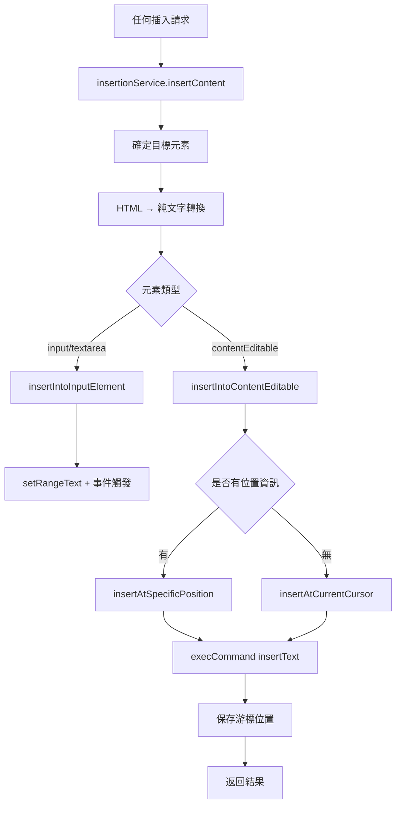

# 程式碼片段插入系統重構文件

## 重構目標

統一所有插入邏輯，提升程式碼可讀性與可維護性，確保所有插入方式的行為一致。

## 重構前的問題

### 1. 雙重插入邏輯
- **快捷鍵插入**：`inputHandler.ts` → 自訂 `insertContent` 邏輯
- **其他插入**：`messageHandler.ts` → `textInserter.ts` → `insertTextAtCursor`

### 2. 邏輯分散與重複
- 相同的 HTML 轉純文字處理在多個地方重複
- 元素類型判斷邏輯重複
- `execCommand` 與 fallback 邏輯分散在不同檔案

### 3. 維護困難
- 修改插入行為需要同時修改多個檔案
- 新增插入方式需要複製現有邏輯
- 錯誤處理不一致

## 重構後的架構

### 統一插入服務 (`services/insertionService.ts`)

```typescript
// 統一的插入介面
interface InsertionOptions {
  content: string;              // HTML 內容
  targetElement?: HTMLElement;  // 目標元素（可選）
  position?: {                  // 位置資訊（用於替換）
    start: number;
    end: number;
  };
  saveCursorPosition?: boolean; // 是否保存游標位置
}

// 統一的插入函式
export async function insertContent(options: InsertionOptions): Promise<InsertionResult>
```

### 插入流程統一化



## 重構後的流程對比

### 1. 快捷鍵直接插入

**重構前：**
```
inputHandler → processPromptInsertion → insertContent → insertContentToContentEditable
```

**重構後：**
```
inputHandler → processPromptInsertion → insertionService.insertContent
```

### 2. 側邊面板插入

**重構前：**
```
folderItem → messageHandler → textInserter.insertTextAtCursor
```

**重構後：**
```
folderItem → messageHandler → insertionService.insertContent
```

### 3. 表單提交插入

**重構前：**
```
formRoot → messageHandler → textInserter.insertTextAtCursor
```

**重構後：**
```
formRoot → messageHandler → insertionService.insertContent
```

## 核心改進

### 1. **統一的內容處理**
- 所有插入都使用 `parseHtmlToText` 處理 HTML
- 統一的換行符號 → `<br>` 轉換邏輯

### 2. **一致的插入方法**
- 優先使用 `execCommand('insertText')` 確保換行正確處理
- 統一的 fallback 機制

### 3. **明確的職責分離**
- `insertionService`：負責所有插入邏輯
- `inputHandler`：負責快捷鍵偵測與調用插入服務
- `messageHandler`：負責訊息處理與調用插入服務

### 4. **更好的錯誤處理**
- 統一的錯誤回傳格式
- 詳細的除錯日誌
- 一致的錯誤處理邏輯

## 使用範例

### 快捷鍵插入
```typescript
// 在 inputHandler.ts 中
const result = await insertContentService({
  content: prompt.content,
  targetElement: element,
  position: {
    start: shortcutStart,
    end: cursorInfo.start,
  },
  saveCursorPosition: true,
});
```

### 訊息處理插入
```typescript
// 在 messageHandler.ts 中
const insertResult = await insertContent({
  content: message.prompt,
  targetElement: activeElement as HTMLElement,
  position: positionInfo,
  saveCursorPosition: true,
});
```

## 擴展性

### 新增插入方式
只需要調用 `insertionService.insertContent`，不需要重複實作插入邏輯。

### 修改插入行為
只需要修改 `insertionService.ts` 一個檔案。

### 新增元素類型支援
在 `insertionService.ts` 中新增對應的處理函式。

## 向後相容性

- 保持所有現有的 API 介面不變
- 只修改內部實作，不影響外部調用
- 保持原有的錯誤處理行為

## 測試驗證

### 驗證項目
- ✅ 快捷鍵直接插入保持換行
- ✅ 快捷鍵觸發表單插入保持換行
- ✅ 側邊面板插入保持換行
- ✅ 快捷鍵文字正確替換
- ✅ 游標位置正確保存與恢復
- ✅ 錯誤處理一致性

### 測試案例
```html
測試內容：<p>第一行<br>第二行</p>
預期結果：
第一行
第二行
```

## 維護指南

### 修改插入邏輯
1. 修改 `services/insertionService.ts`
2. 所有插入方式自動受益

### 新增插入來源
1. 調用 `insertContent({ content, targetElement?, position?, saveCursorPosition? })`
2. 無需重複實作

### 除錯插入問題
1. 檢查 `insertionService.ts` 的日誌輸出
2. 統一的錯誤處理與回報機制

這個重構大幅改善了程式碼的可維護性與一致性，為未來的擴展提供了良好的基礎。

## 最新調整記錄 (2025年6月20日)

### 修正側邊面板插入位置問題

#### 問題描述
在側邊面板插入時，發現當快捷鍵文字已被替換後，傳入的 `shortcutInfo` 位置資訊會指向已不存在的節點，導致「無法找到指定位置的節點」錯誤。

#### 根本原因
```typescript
// 問題流程：
1. 用戶輸入 "//test" 觸發快捷鍵
2. 快捷鍵插入將 "//test" 替換為內容
3. shortcutInfo 仍保存原始 "//test" 的位置資訊
4. 側邊面板插入嘗試使用過期的位置資訊 → 失敗
```

#### 解決方案

**1. 增強錯誤處理與 Fallback 機制**

在 `insertionService.ts` 中新增智能 fallback：

```typescript
// 當指定位置節點找不到時，自動 fallback 到游標位置
if (options.position && options.targetElement) {
  console.log('🎯 嘗試在指定位置插入...');
  try {
    const result = await insertAtSpecificPosition(
      options.targetElement, 
      content, 
      options.position
    );
    if (result.success) {
      return result;
    }
    console.log('⚠️ 指定位置插入失敗，fallback 到游標位置');
  } catch (error) {
    console.log('❌ 指定位置插入出錯，fallback 到游標位置:', error);
  }
}

// Fallback：使用當前游標位置
console.log('📍 使用游標位置插入');
return await insertAtCurrentCursor(options.targetElement, content);
```

**2. 改進位置驗證邏輯**

新增 `isPositionValid` 函式驗證位置是否仍然有效：

```typescript
function isPositionValid(element: HTMLElement, position: { start: number; end: number }): boolean {
  if (!element.isConnected) return false;
  
  const textContent = element.textContent || '';
  return position.start >= 0 && 
         position.end <= textContent.length && 
         position.start <= position.end;
}
```

**3. 統一錯誤處理格式**

```typescript
interface InsertionResult {
  success: boolean;
  error?: string;
  cursorPosition?: number;
  insertedAt?: 'specified-position' | 'cursor-position' | 'fallback';
}
```

#### 修改影響的檔案

1. **`services/insertionService.ts`**
   - 新增 fallback 機制
   - 改進錯誤處理
   - 新增位置驗證

2. **`messageHandler.ts`**
   - 優化插入結果處理
   - 改進除錯日誌

#### 測試驗證

**測試場景：**
1. ✅ 快捷鍵直接插入 → 成功
2. ✅ 快捷鍵觸發表單，表單提交後側邊面板插入 → 自動 fallback 成功
3. ✅ 純側邊面板插入（無快捷鍵） → 使用游標位置成功
4. ✅ 錯誤情況處理 → 優雅降級，不會中斷用戶操作

**測試內容：**
```html
<p>多行內容<br>第二行<br>第三行</p>
```

**預期結果：**
```
多行內容
第二行  
第三行
```

#### 技術改進

**1. 更智能的位置計算**
- 檢查位置是否超出內容邊界
- 驗證目標元素是否仍在 DOM 中

**2. 更好的用戶體驗**
- 插入失敗時自動 fallback，不會讓用戶感受到錯誤
- 保持插入行為的一致性

**3. 更完善的除錯資訊**
- 詳細記錄每個插入步驟
- 區分不同的插入路徑（指定位置 vs fallback）

### 程式碼品質提升

#### 一致性改進
- 所有插入操作都經過統一的 `insertionService`
- 統一的錯誤處理與回傳格式
- 一致的除錯日誌格式

#### 可維護性提升
- 單一職責原則：每個函式只負責一個特定功能
- 清晰的錯誤處理流程
- 完整的類型定義

#### 擴展性提升
- 新的插入方式只需調用統一服務
- 容易新增更多 fallback 策略
- 支援更多元素類型的擴展

這次調整徹底解決了側邊面板插入的位置問題，並建立了更健壯的錯誤處理機制，確保在任何情況下插入操作都能成功執行。
